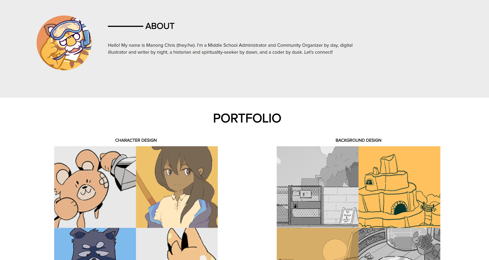

# portfolio-2022

## Description

This repository was built from the ground-up for the UC Davis Full Stacks Coding Bootcamp. The repository is an ongoing portfolio that can accommodate ongoing work completed in the Full Stacks Program, as well as additional material outside of the program. 

## Features

The repository includes the following features:

* Semantic elements, including: header, navigation links ("nav"), article, main, and footer.
* Use of alt text on images for accessibility.
* Links that make use of unique CSS IDs for navigation.
* Organized markdown/comments on both HTML and CSS for clear structuring.
* Media query and flexboxes for various resolution and devices.
* CSS variables to store and alter data depending on user story and vision.
* Responsive CSS design, such as text anchors that respond and interact with user.

## Installation

Clone a copy of the repository by going to the repo code and selecting Code. In the drop-down menu, select the method of cloning. To copy directly into the terminal, type `git pull` with the SSH key on the .git file to clone locally.

HTTPS: `https://github.com/christiangella/portfolio-2022.git`
SSH: `git@github.com:christiangella/portfolio-2022.git`

## Deployment

The website can be previewed at the following link: https://christiangella.github.io/portfolio-2022/

## Future Iterations

The website could expand to incorporate the following features:

* Adjust "coding" flexbox to be syncronous with the other flexboxes (currently following constraint of prompt), and smaller.
* Enable responsive design for images, including CSS animations and/or responsive elements.
* Incorporate pages beyond index, including anchors to a portfolio or coding page.
* Reformat images for higher resolution.
* Adjust aesthetic presentation of header, h1, and footer.
* Incorporate CSS animations and JavaScript, including hiding the links bar to `display:none` until activated by a point.
* Further expand use of variables to store colors for general accessibility and streamlining code.

## Credits

This repository was developed for the UC Davis Fullstacks Bootcamp under the UC Davis Continuing and Professional Education.

All images were designed by Manong Chris.
